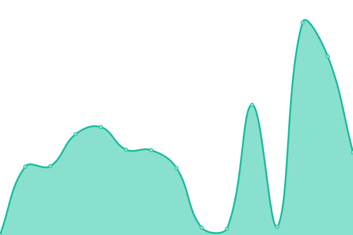
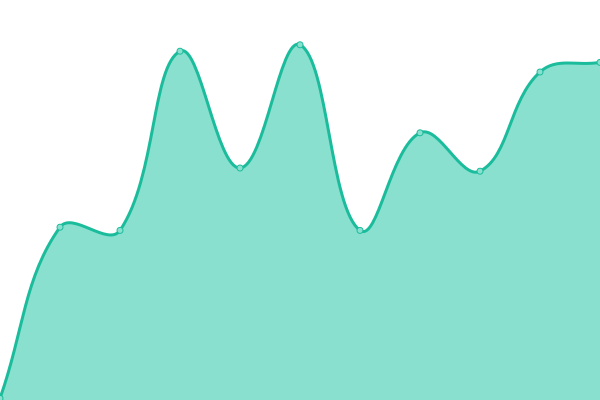

# [📈 Live Status](https://maxime-sourdin.github.io/monitoring): <!--live status--> **🟩 All systems operational**

This repository contains the open-source uptime monitor and status page for [Maxime SOURDIN](https://maxime.sourdin.ovh), powered by [Upptime](https://github.com/upptime/upptime).

With [Upptime](https://upptime.js.org), you can get your own unlimited and free uptime monitor and status page, powered entirely by a GitHub repository. We use [Issues](https://github.com/maxime-sourdin/monitoring/issues) as incident reports, [Actions](https://github.com/maxime-sourdin/monitoring/actions) as uptime monitors, and [Pages](https://maxime-sourdin.github.io/monitoring) for the status page.

<!--start: status pages-->
<!-- This summary is generated by Upptime (https://github.com/upptime/upptime) -->
<!-- Do not edit this manually, your changes will be overwritten -->
<!-- prettier-ignore -->
| URL | Status | History | Response Time | Uptime |
| --- | ------ | ------- | ------------- | ------ |
|  [acme.sourdin.ovh](https://acme.sourdin.ovh) | 🟩 Up | [acme-sourdin-ovh.yml](https://github.com/maxime-sourdin/monitoring/commits/HEAD/history/acme-sourdin-ovh.yml) | 

 622ms
     
 | 

<a href="https://maxime-sourdin.github.io/monitoring/history/acme-sourdin-ovh">100.00%</a>
    

|  [argocd.sourdin.ovh](https://argocd.sourdin.ovh) | 🟩 Up | [argocd-sourdin-ovh.yml](https://github.com/maxime-sourdin/monitoring/commits/HEAD/history/argocd-sourdin-ovh.yml) | 

 525ms
     
 | 

<a href="https://maxime-sourdin.github.io/monitoring/history/argocd-sourdin-ovh">100.00%</a>
    

|  [awx.sourdin.ovh](https://awx.sourdin.ovh) | 🟩 Up | [awx-sourdin-ovh.yml](https://github.com/maxime-sourdin/monitoring/commits/HEAD/history/awx-sourdin-ovh.yml) | 

 2758ms
     
 | 

<a href="https://maxime-sourdin.github.io/monitoring/history/awx-sourdin-ovh">100.00%</a>
    

|  [DNS Over HTTPS](https://dns.sourdin.ovh) | 🟩 Up | [dns-over-https.yml](https://github.com/maxime-sourdin/monitoring/commits/HEAD/history/dns-over-https.yml) | 

 566ms
     
 | 

<a href="https://maxime-sourdin.github.io/monitoring/history/dns-over-https">100.00%</a>
    

|  [grafana.sourdin.ovh](https://grafana.sourdin.ovh) | 🟩 Up | [grafana-sourdin-ovh.yml](https://github.com/maxime-sourdin/monitoring/commits/HEAD/history/grafana-sourdin-ovh.yml) | 

 955ms
     
 | 

<a href="https://maxime-sourdin.github.io/monitoring/history/grafana-sourdin-ovh">100.00%</a>
    

|  [maxime.sourdin.ovh](https://maxime.sourdin.ovh) | 🟩 Up | [maxime-sourdin-ovh.yml](https://github.com/maxime-sourdin/monitoring/commits/HEAD/history/maxime-sourdin-ovh.yml) | 

 1023ms
     
 | 

<a href="https://maxime-sourdin.github.io/monitoring/history/maxime-sourdin-ovh">100.00%</a>
    

|  [proxy-docker.sourdin.ovh](https://proxy-docker.sourdin.ovh) | 🟩 Up | [proxy-docker-sourdin-ovh.yml](https://github.com/maxime-sourdin/monitoring/commits/HEAD/history/proxy-docker-sourdin-ovh.yml) | 

 602ms
     
 | 

<a href="https://maxime-sourdin.github.io/monitoring/history/proxy-docker-sourdin-ovh">98.10%</a>
    

|  [repo-docker.sourdin.ovh](https://repo-docker.sourdin.ovh) | 🟩 Up | [repo-docker-sourdin-ovh.yml](https://github.com/maxime-sourdin/monitoring/commits/HEAD/history/repo-docker-sourdin-ovh.yml) | 

 597ms
     
 | 

<a href="https://maxime-sourdin.github.io/monitoring/history/repo-docker-sourdin-ovh">98.09%</a>
    

|  [repo-pub-docker.sourdin.ovh](https://repo-pub-docker.sourdin.ovh) | 🟩 Up | [repo-pub-docker-sourdin-ovh.yml](https://github.com/maxime-sourdin/monitoring/commits/HEAD/history/repo-pub-docker-sourdin-ovh.yml) | 

 552ms
     
 | 

<a href="https://maxime-sourdin.github.io/monitoring/history/repo-pub-docker-sourdin-ovh">98.09%</a>
    

|  [rss.sourdin.ovh](https://rss.sourdin.ovh) | 🟩 Up | [rss-sourdin-ovh.yml](https://github.com/maxime-sourdin/monitoring/commits/HEAD/history/rss-sourdin-ovh.yml) | 

 521ms
     
 | 

<a href="https://maxime-sourdin.github.io/monitoring/history/rss-sourdin-ovh">100.00%</a>
    

|  [rss-bridge.sourdin.ovh](https://rss-bridge.sourdin.ovh) | 🟩 Up | [rss-bridge-sourdin-ovh.yml](https://github.com/maxime-sourdin/monitoring/commits/HEAD/history/rss-bridge-sourdin-ovh.yml) | 

 1470ms
     
 | 

<a href="https://maxime-sourdin.github.io/monitoring/history/rss-bridge-sourdin-ovh">100.00%</a>
    

|  [shaarli.sourdin.ovh](https://shaarli.sourdin.ovh) | 🟩 Up | [shaarli-sourdin-ovh.yml](https://github.com/maxime-sourdin/monitoring/commits/HEAD/history/shaarli-sourdin-ovh.yml) | 

 5784ms
     
 | 

<a href="https://maxime-sourdin.github.io/monitoring/history/shaarli-sourdin-ovh">100.00%</a>
    

|  [DNS over TLS](dns.sourdin.ovh) | 🟩 Up | [dns-over-tls.yml](https://github.com/maxime-sourdin/monitoring/commits/HEAD/history/dns-over-tls.yml) | 

 273ms
     
 | 

<a href="https://maxime-sourdin.github.io/monitoring/history/dns-over-tls">100.00%</a>
    

|  [pve](appart.sourdin.ovh) | 🟩 Up | [pve.yml](https://github.com/maxime-sourdin/monitoring/commits/HEAD/history/pve.yml) | 

 240ms
     
 | 

<a href="https://maxime-sourdin.github.io/monitoring/history/pve">100.00%</a>
    

|  [biscuit.town](https://biscuit.town) | 🟩 Up | [biscuit-town.yml](https://github.com/maxime-sourdin/monitoring/commits/HEAD/history/biscuit-town.yml) | 

 729ms
     
 | 

<a href="https://maxime-sourdin.github.io/monitoring/history/biscuit-town">100.00%</a>
    

|  [pipou.academy](https://pipou.academy) | 🟩 Up | [pipou-academy.yml](https://github.com/maxime-sourdin/monitoring/commits/HEAD/history/pipou-academy.yml) | 

 1079ms
     
 | 

<a href="https://maxime-sourdin.github.io/monitoring/history/pipou-academy">100.00%</a>
    

|  [botsin.space](https://botsin.space) | 🟩 Up | [botsin-space.yml](https://github.com/maxime-sourdin/monitoring/commits/HEAD/history/botsin-space.yml) | 

 309ms
     
 | 

<a href="https://maxime-sourdin.github.io/monitoring/history/botsin-space">100.00%</a>
    

<!--end: status pages-->

[**Visit our status website →**](https://maxime-sourdin.github.io/monitoring)

## 📄 License

- Powered by: [Upptime](https://github.com/upptime/upptime)
- Code: [MIT](./LICENSE) © [Maxime SOURDIN](https://maxime.sourdin.ovh)
- Data in the `./history` directory: [Open Database License](https://opendatacommons.org/licenses/odbl/1-0/)
