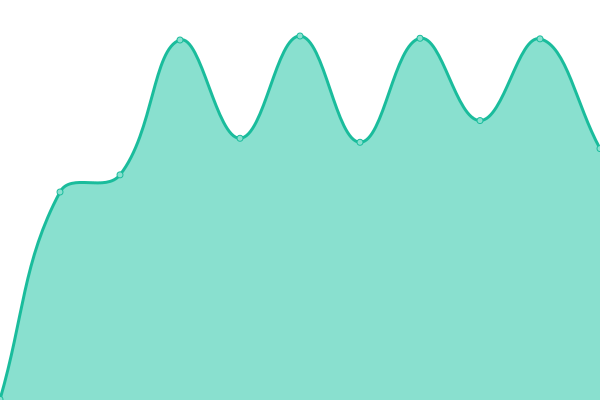
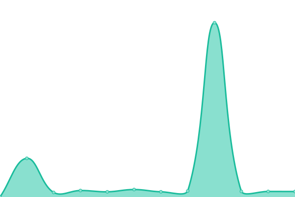

# [📈 Live Status](https://maxime-sourdin.github.io/monitoring): <!--live status--> **🟧 Partial outage**

This repository contains the open-source uptime monitor and status page for [Maxime SOURDIN](https://maxime.sourdin.ovh), powered by [Upptime](https://github.com/upptime/upptime).

With [Upptime](https://upptime.js.org), you can get your own unlimited and free uptime monitor and status page, powered entirely by a GitHub repository. We use [Issues](https://github.com/maxime-sourdin/monitoring/issues) as incident reports, [Actions](https://github.com/maxime-sourdin/monitoring/actions) as uptime monitors, and [Pages](https://maxime-sourdin.github.io/monitoring) for the status page.

<!--start: status pages-->
<!-- This summary is generated by Upptime (https://github.com/upptime/upptime) -->
<!-- Do not edit this manually, your changes will be overwritten -->
<!-- prettier-ignore -->
| URL | Status | History | Response Time | Uptime |
| --- | ------ | ------- | ------------- | ------ |
|  [acme.sourdin.ovh](https://acme.sourdin.ovh) | 🟩 Up | [acme-sourdin-ovh.yml](https://github.com/maxime-sourdin/monitoring/commits/HEAD/history/acme-sourdin-ovh.yml) | 

 558ms
     
 | 

<a href="https://monitoring.sourdin.ovh/history/acme-sourdin-ovh">100.00%</a>
    

|  [argocd.sourdin.ovh](https://argocd.sourdin.ovh) | 🟩 Up | [argocd-sourdin-ovh.yml](https://github.com/maxime-sourdin/monitoring/commits/HEAD/history/argocd-sourdin-ovh.yml) | 

 559ms
     
 | 

<a href="https://monitoring.sourdin.ovh/history/argocd-sourdin-ovh">100.00%</a>
    

|  [awx.sourdin.ovh](https://awx.sourdin.ovh) | 🟩 Up | [awx-sourdin-ovh.yml](https://github.com/maxime-sourdin/monitoring/commits/HEAD/history/awx-sourdin-ovh.yml) | 

 732ms
     
 | 

<a href="https://monitoring.sourdin.ovh/history/awx-sourdin-ovh">99.44%</a>
    

|  [DNS Over HTTPS](https://dns.sourdin.ovh) | 🟩 Up | [dns-over-https.yml](https://github.com/maxime-sourdin/monitoring/commits/HEAD/history/dns-over-https.yml) | 

 520ms
     
 | 

<a href="https://monitoring.sourdin.ovh/history/dns-over-https">100.00%</a>
    

|  [grafana.sourdin.ovh](https://grafana.sourdin.ovh) | 🟩 Up | [grafana-sourdin-ovh.yml](https://github.com/maxime-sourdin/monitoring/commits/HEAD/history/grafana-sourdin-ovh.yml) | 

 817ms
     
 | 

<a href="https://monitoring.sourdin.ovh/history/grafana-sourdin-ovh">100.00%</a>
    

|  [nidruos.sourdin.ovh](https://nidruos.sourdin.ovh) | 🟩 Up | [nidruos-sourdin-ovh.yml](https://github.com/maxime-sourdin/monitoring/commits/HEAD/history/nidruos-sourdin-ovh.yml) | 

 493ms
     
 | 

<a href="https://monitoring.sourdin.ovh/history/nidruos-sourdin-ovh">100.00%</a>
    

|  [maxime.sourdin.ovh](https://maxime.sourdin.ovh) | 🟩 Up | [maxime-sourdin-ovh.yml](https://github.com/maxime-sourdin/monitoring/commits/HEAD/history/maxime-sourdin-ovh.yml) | 

 252ms
     
 | 

<a href="https://monitoring.sourdin.ovh/history/maxime-sourdin-ovh">100.00%</a>
    

|  [monitoring.sourdin.ovh](https://monitoring.sourdin.ovh) | 🟩 Up | [monitoring-sourdin-ovh.yml](https://github.com/maxime-sourdin/monitoring/commits/HEAD/history/monitoring-sourdin-ovh.yml) | 

 272ms
     
 | 

<a href="https://monitoring.sourdin.ovh/history/monitoring-sourdin-ovh">100.00%</a>
    

|  [rss.sourdin.ovh](https://rss.sourdin.ovh) | 🟩 Up | [rss-sourdin-ovh.yml](https://github.com/maxime-sourdin/monitoring/commits/HEAD/history/rss-sourdin-ovh.yml) | 

 558ms
     
 | 

<a href="https://monitoring.sourdin.ovh/history/rss-sourdin-ovh">100.00%</a>
    

|  [rss-bridge.sourdin.ovh](https://rss-bridge.sourdin.ovh) | 🟩 Up | [rss-bridge-sourdin-ovh.yml](https://github.com/maxime-sourdin/monitoring/commits/HEAD/history/rss-bridge-sourdin-ovh.yml) | 

 2124ms
     
 | 

<a href="https://monitoring.sourdin.ovh/history/rss-bridge-sourdin-ovh">100.00%</a>
    

|  [shaarli.sourdin.ovh](https://shaarli.sourdin.ovh) | 🟩 Up | [shaarli-sourdin-ovh.yml](https://github.com/maxime-sourdin/monitoring/commits/HEAD/history/shaarli-sourdin-ovh.yml) | 

 7324ms
     
 | 

<a href="https://monitoring.sourdin.ovh/history/shaarli-sourdin-ovh">100.00%</a>
    

|  [DNS over TLS](dns.sourdin.ovh) | 🟩 Up | [dns-over-tls.yml](https://github.com/maxime-sourdin/monitoring/commits/HEAD/history/dns-over-tls.yml) | 

 236ms
     
 | 

<a href="https://monitoring.sourdin.ovh/history/dns-over-tls">99.51%</a>
    

|  [http](appart.sourdin.ovh) | 🟩 Up | [http.yml](https://github.com/maxime-sourdin/monitoring/commits/HEAD/history/http.yml) | 

 227ms
     
 | 

<a href="https://monitoring.sourdin.ovh/history/http">100.00%</a>
    

|  [https](appart.sourdin.ovh) | 🟩 Up | [https.yml](https://github.com/maxime-sourdin/monitoring/commits/HEAD/history/https.yml) | 

 177ms
     
 | 

<a href="https://monitoring.sourdin.ovh/history/https">100.00%</a>
    

|  [pve](appart.sourdin.ovh) | 🟩 Up | [pve.yml](https://github.com/maxime-sourdin/monitoring/commits/HEAD/history/pve.yml) | 

 152ms
     
 | 

<a href="https://monitoring.sourdin.ovh/history/pve">99.53%</a>
    

|  [biscuit.town](https://biscuit.town) | 🟩 Up | [biscuit-town.yml](https://github.com/maxime-sourdin/monitoring/commits/HEAD/history/biscuit-town.yml) | 

 901ms
     
 | 

<a href="https://monitoring.sourdin.ovh/history/biscuit-town">100.00%</a>
    

|  [ouin.land](https://ouin.land) | 🟩 Up | [ouin-land.yml](https://github.com/maxime-sourdin/monitoring/commits/HEAD/history/ouin-land.yml) | 

 883ms
     
 | 

<a href="https://monitoring.sourdin.ovh/history/ouin-land">100.00%</a>
    

|  [pipou.academy](https://pipou.academy) | 🟩 Up | [pipou-academy.yml](https://github.com/maxime-sourdin/monitoring/commits/HEAD/history/pipou-academy.yml) | 

 1453ms
     
 | 

<a href="https://monitoring.sourdin.ovh/history/pipou-academy">100.00%</a>
    

|  [botsin.space](https://botsin.space) | 🟥 Down | [botsin-space.yml](https://github.com/maxime-sourdin/monitoring/commits/HEAD/history/botsin-space.yml) | 

 663ms
     
 | 

<a href="https://monitoring.sourdin.ovh/history/botsin-space">99.66%</a>
    

|  [maximedurand-ux.fr](https://www.maximedurand-ux.fr) | 🟩 Up | [maximedurand-ux-fr.yml](https://github.com/maxime-sourdin/monitoring/commits/HEAD/history/maximedurand-ux-fr.yml) | 

 724ms
     
 | 

<a href="https://monitoring.sourdin.ovh/history/maximedurand-ux-fr">100.00%</a>
    

<!--end: status pages-->

[**Visit our status website →**](https://maxime-sourdin.github.io/monitoring)

## 📄 License

- Powered by: [Upptime](https://github.com/upptime/upptime)
- Code: [MIT](./LICENSE) © [Maxime SOURDIN](https://maxime.sourdin.ovh)
- Data in the `./history` directory: [Open Database License](https://opendatacommons.org/licenses/odbl/1-0/)
